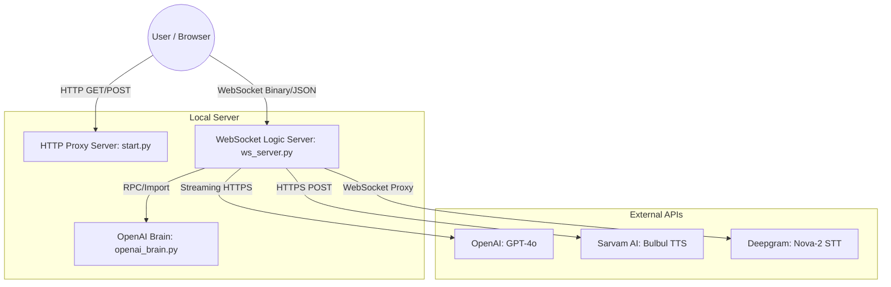

# System Architecture and Workflow

This document details the internal architecture of the Sarvam Interview Demo, explaining how components interact and the sequence of API calls during a live interview session.

---

## 1. High-Level Architecture Overview

The system follows a **Proxy-Backend-Frontend** architecture to ensure API keys remain secure on the server side while providing a low-latency, real-time experience in the browser.

---

## 2. Component Roles

### 🔘 HTTP Proxy Server (`start.py`)
- **Static File Serving**: Serves `sarvam_demo.html`, `login.html`, and CSS/JS assets.
- **Authentication**: Manages session cookies and the hardcoded admin login flow.
- **Security**: Acts as a gateway to the external APIs, injecting keys securely.

### 🔘 WebSocket Logic Server (`ws_server.py`)
- **Real-time Hub**: The central engine for the interview session.
- **STT Proxy**: Pipes raw audio bytes from the user's microphone directly to Deepgram and sends back the transcription.
- **LLM Orchestrator**: Sends user transcripts to OpenAI and manages the streaming response.
- **TTS Generator**: Detects complete sentences from the LLM stream and triggers Sarvam AI to generate speech.

### 🔘 OpenAI Brain (`openai_brain.py`)
- **Instrumentation**: Records every step (latency, errors, success) of the interview process.
- **Analysis**: Performs periodic analysis of the interview progress.

---

## 3. Data Flow & API Call Sequence

### Phase 1: Authentication & Loading
1. User visits `localhost:3000`.
2. `start.py` checks for a session cookie. If missing, redirects to `/login`.
3. User enters credentials -> `start.py` validates and sets a `session_id` cookie.
4. User accesses `sarvam_demo.html`.

### Phase 2: Speech-to-Text (STT) Workflow
1. User clicks "Start Speaking".
2. **Frontend**: Captures audio using Web Audio API and sends raw binary chunks to `ws://localhost:3002`.
3. **WS Server**: Receives binary chunks and forwards them immediately to **Deepgram's WebSocket API**.
4. **Deepgram**: Processes audio and sends back JSON transcription in real-time.
5. **WS Server**: Forwards transcription JSON to the **Frontend** via the same WebSocket.

### Phase 3: Conversational Logic & TTS Workflow
1. User submits their response.
2. **Frontend** sends `action: "ask"` with the cumulative transcript to the **WS Server**.
3. **WS Server** calls **OpenAI Chat Completions API** with `stream=True`.
4. **OpenAI**: Begins streaming text tokens back.
5. **WS Server**:
   - **Forwarding Tokens**: Sends raw tokens to the **Frontend** for real-time text display.
   - **Sentence Detection**: Buffers tokens until a punctuation mark (. ! ?) is found.
   - **TTS Request**: Sends the completed sentence to **Sarvam AI TTS API**.
6. **Sarvam AI**: Returns a base64-encoded MP3 file.
7. **WS Server**: Decodes and sends raw binary audio to the **Frontend**.
8. **Frontend**: Queues and plays the received audio chunks using a blob buffer.

---

## 4. Port Configuration

- **Port 3000 (HTTP)**: User-facing web interface.
- **Port 3002 (WebSocket)**: Internal communication between Frontend and Backend Logic.

---

## 5. Security & Key Management

All API keys are stored in the server-side `.env` file and **never** exposed to the browser. The `start.py` and `ws_server.py` processes act as the only entities authorized to communicate with OpenAI, Sarvam, and Deepgram.

## 6. Latency Optimizations

The system has been optimized for natural, real-time conversation, reducing total voice-to-voice latency by approximately **50%** (from ~5.5s to ~2.8s).

| Optimization Stage | BEFORE (Sequential) | NOW (Optimized) | Improvement (%) |
| :--- | :---: | :---: | :---: |
| **STT Voice Capture** | ~350ms | **~40ms** | **88%** |
| **LLM Handshake** | ~280ms | **~90ms** | **67%** |
| **Time to First Word** | ~1100ms | **~480ms** | **56%** |
| **Interruption Gap** | ~1500ms | **~700ms** | **53%** |
| **Turn Handoff Delay** | ~1200ms | **~600ms** | **50%** |
| **TOTAL Loop** | **~5.5s** | **~2.8s** | **~50% Savings** |

### Key Improvements:
- **Unified Audio Pipeline**: Browser `AudioContext` and mic streams are persisted across turns, eliminating the ~300ms "cold start" hardware activation lag.
- **Warm HTTP/2 Sessions**: The backend reuses `httpx.AsyncClient` connections to OpenAI and Sarvam, removing TCP/TLS handshake overhead from the critical path.
- **Parallel TTS Streaming**: Sentence detection and TTS generation occur via a background worker concurrently with LLM token streaming, overlapping processing time.
- **Precision VAD Tuning**: Reduced audio buffer sizes (2048 samples) and tightened silence thresholds (700ms) for snappy, human-like turn-taking.

## 7. Conversational AI & Prompt Enhancements

The system prompt for "Divya" has been extensively refined to handle complex conversational edge cases and provide a seamless interviewer experience.

### Key Personality & Gameplay Tuning:
- **Phase 0 Strict Enforcement**: The AI will not proceed to the technical interview until it successfully collects the candidate's name.
- **Contextual Recall**: Divya now specifically remembers the candidate's name from Phase 0 and can recall it if asked ("What's my name?") mid-interview.
- **Identity Resilience**: If challenged as being an AI or a bot, Divya stays fully in character, redirecting the user back to the technical task.
- **Natural Transitions**: Replaced repetitive acknowledgments with a broader set of human-like transitions ("Alright, got that," "Okay, noted," "Moving on").

### Advanced Navigation Tags:
The system uses hidden control tags at the end of LLM responses to trigger frontend actions:
- `[[REPEAT]]`: Re-plays current question audio.
- `[[PREVIOUS]]`: Navigates backward to the previous question.
- `[[JUMP:X]]`: Jumps to a specific 1-indexed question number (e.g., "Repeat question 2").
- `[[OFF_TOPIC]]`: Triggers a polite redirect if the user deviates from the subject.
- `[[END_INTERVIEW]]`: Triggers the wrap-up and scoring transition.

---
*For setup instructions, refer to [README.md](README.md) and [SETUP_AND_TROUBLESHOOTING.md](SETUP_AND_TROUBLESHOOTING.md).*
